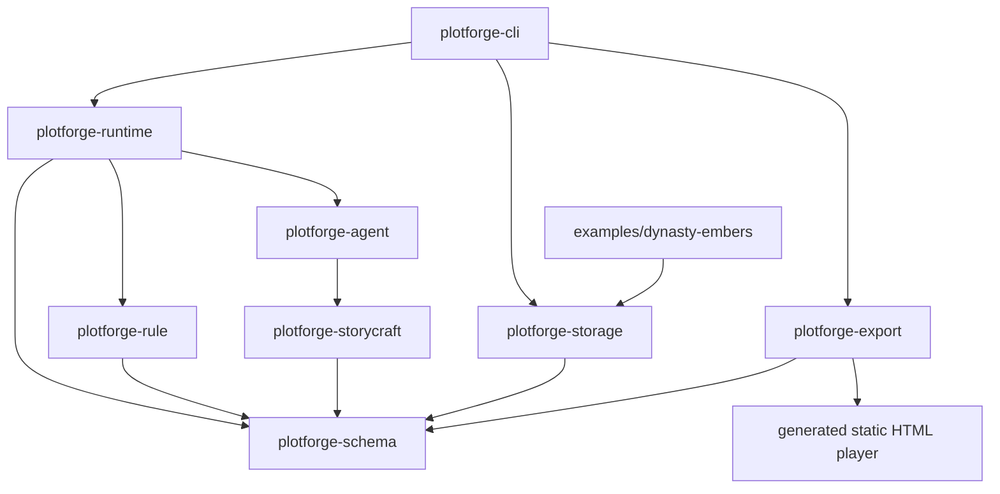

# Project Overview

## Direction

Continue from the current CLI-first Rust MVP toward the full PlotForge PRD: Rust Core plus Tauri v2 desktop shell, React/TypeScript Studio, provider-backed story generation, media pipeline, debugger, richer exports, and later Steam/Workshop exploration.

This is not a rewrite of the completed MVP. It is a staged expansion from the current baseline.

## Current Architecture

PlotForge is currently a Rust workspace with a deterministic CLI MVP. The source of truth for playable projects is a folder project containing TOML, JSON, Markdown, and generated local assets. The committed fixture is `examples/dynasty-embers`.



## Current Project Structure

| Path | Role |
|:--|:--|
| `Cargo.toml` | Rust 2024 workspace root with 8 crates. |
| `crates/plotforge-schema` | Contract source for project, state, scene, rule, trace, review, and export data. |
| `crates/plotforge-rule` | Declarative rule evaluation and world delta application. |
| `crates/plotforge-storycraft` | Story craft seed data and narrative review heuristics. |
| `crates/plotforge-agent` | `ScenePlanner` trait plus deterministic mock pipeline. |
| `crates/plotforge-runtime` | Runtime session, action interpretation, rule commit, scene planning, trace assembly. |
| `crates/plotforge-storage` | Folder project creation/loading/validation, demo generation, trace writes, placeholder assets. |
| `crates/plotforge-export` | Static web export manifest, generated HTML player, asset output, secret marker scan. |
| `crates/plotforge-cli` | CLI commands: `new`, `check`, `play --once`, `trace inspect`, `export static`. |
| `apps/player-web` | Placeholder for future standalone web player; currently README only. |
| `examples/dynasty-embers` | Committed demo fixture for the historical crisis simulation. |
| `scripts/qa` | Local full QA, export HTTP smoke, and Computer Use runbook. |
| `.github/workflows/ci.yml` | Split CI jobs for Rust static checks, unit/integration tests, CLI smoke, export smoke. |

## Technology Stack

| Layer | Current | PRD Full Target |
|:--|:--|:--|
| Core | Rust 2024 workspace | Rust engine with schema/runtime/rules/storycraft/agent/media/storage/export/steam boundaries |
| CLI | `clap`, `anyhow` | Developer/debug surface retained |
| Data | TOML / JSON / Markdown folder project | Folder project remains source of truth; SQLite only cache/index/trace/asset metadata |
| Serialization | `serde`, `serde_json`, `toml` | Schema-driven JSON/TS contracts and migration/version checks |
| UI | Generated static HTML player | Tauri v2 + React + TypeScript + Vite + Tailwind + Monaco Studio |
| Providers | Deterministic mock only | Text/Image/TTS/Vision/Moderation provider ports with secure BYO key handling |
| Media | Placeholder PNG output | Asset registry, image/TTS jobs, hash dedupe, references, traceable fallback |
| Export | Static output directory | Zip/static package, desktop runtime export, BYO web/self-host profiles, Steam submission kit |
| Steam | None | Later Workshop package schema, AI Usage Manifest, submission checklist |
| QA | Cargo tests, CLI smoke, export HTTP smoke, CI | Add frontend, provider fake, media/job, export package, desktop smoke gates |

## Entry Points

- CLI: `crates/plotforge-cli/src/main.rs`
- Runtime: `RuntimeSession::play_once`
- Rule engine: `RuleEngine::evaluate` and `RuleEngine::apply_delta`
- Agent port: `ScenePlanner`
- Storage: `create_demo_project`, `load_project`, `validate_project`, `write_trace`
- Export: `export_static_web`
- QA gate: `scripts/qa/full_local.sh`

## Current Commands

```bash
cargo fmt --all -- --check
cargo check --workspace
cargo test --workspace
cargo clippy --workspace --all-targets -- -D warnings
scripts/qa/full_local.sh
```

Tempdir CLI smoke:

```bash
tmp="$(mktemp -d)"
cargo run -p plotforge-cli -- new demo --path "$tmp/dynasty-embers" --force
cargo run -p plotforge-cli -- check "$tmp/dynasty-embers"
cargo run -p plotforge-cli -- play "$tmp/dynasty-embers" --once
cargo run -p plotforge-cli -- trace inspect "$tmp/dynasty-embers/traces/latest.json"
cargo run -p plotforge-cli -- export static "$tmp/dynasty-embers" --out "$tmp/export"
python3 scripts/qa/static_export_http_smoke.py --export-dir "$tmp/export"
```

## Implemented Capabilities

- Complete CLI-first MVP workspace.
- Project/schema/runtime/rule/storycraft/agent/storage/export crates.
- Deterministic `Dynasty Embers` project generation and committed fixture validation.
- One-step runtime loop with world delta commit and runtime trace.
- Basic narrative review, plot thread updates, and explicit mock fallback trace.
- Static web export without model calls or API keys.
- Full local QA script and GitHub CI split into four jobs.
- Codex Desktop Computer Use runbook for local static export smoke.

## Full-Version Gaps

| Area | Current | Gap |
|:--|:--|:--|
| Core hardening | Runtime directly interprets input and constructs mock agent | Need `ActionIntent`, policy/sanitizer, injected planner/provider ports, explicit unknown intent handling |
| Schema contracts | Rust structs and serde tests | Need PRD fields, JSON Schema/TS contract generation, version/migration strategy |
| Story craft | Review heuristics and demo seed | Need Story Architect, Planner, Plot Doctor, Consistency Checker, Deslop, reference analysis boundaries |
| Storage | Folder load/write and demo generation | Need separated template/layout/trace/asset/cache responsibilities and SQLite cache as non-source-of-truth |
| Desktop Studio | Absent | Need Tauri command adapter, React Studio, editor, playtest, debugger, assets, export panes |
| Provider | Mock only | Need TextModelProvider first, then Image/TTS/Vision/Moderation ports and fake-provider tests |
| Media | Placeholder assets | Need AssetRecord, hash dedupe, reference tracking, job queue, visible placeholder fallback |
| Debugger | Trace CLI only | Need trace redaction, agent/media calls, costs/errors/fallback UI and inspection APIs |
| Export | Static output directory | Need package manifest whitelist, zip export, asset reachability, no secret/provider/traces policy |
| Steam/Workshop | Absent | Later package schema, AI Usage Manifest, Workshop exploration; no launch promises until implemented |

## Tracking Mode

GitHub pre-flight detected `GITHUB_STANDARD` for `zhu1090093659/plotforge`: Issues, Labels, Milestones, branches, PRs are available; GitHub Project board is not available because the current token lacks `project` scope.
