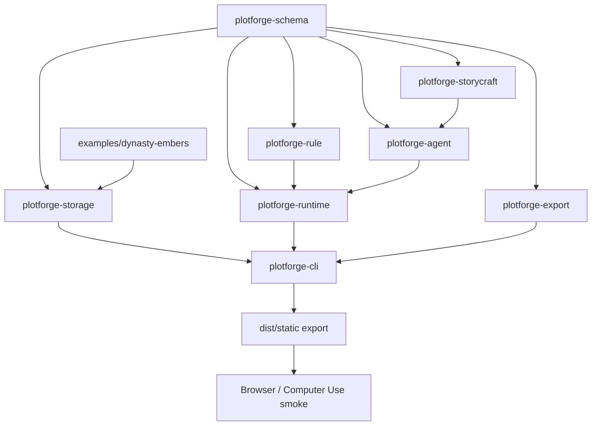

# Project Overview

## Preliminary Direction

Build a comprehensive PlotForge test system that covers Rust contracts, pure logic, project fixtures, CLI end-to-end behavior, static export smoke checks, CI gates, and Codex Desktop Computer Use visual verification.

## Current Architecture

PlotForge is currently a CLI-first Rust workspace with eight crates and a checked-in `examples/dynasty-embers` project fixture. The prior MVP spec-driven artifacts are archived under `docs/archives/plotforge-mvp/`; there is no active `docs/progress/MASTER.md`, so this is a fresh spec-driven run.



The current automated test base is mostly inline crate unit tests. CI runs formatting, `cargo check`, `cargo test`, and clippy in one Rust job. CLI behavior, committed fixture compatibility, export HTML behavior, negative paths, and desktop visual smoke are not yet encoded as a repeatable system.

## Technology Stack

| Layer | Current | Target |
|:--|:--|:--|
| Language | Rust 2024 | Rust 2024 plus small Python/std shell QA scripts |
| Test Framework | Rust `#[test]` | Unit, integration, CLI smoke, export smoke, fixture drift checks |
| Build Tool | Cargo workspace | Cargo workspace plus scripts under `scripts/qa/` |
| CI | GitHub Actions single Rust job | Split static/unit/CLI/export QA jobs |
| Browser/Desktop | Manual only | Local HTTP export smoke plus Codex Desktop Computer Use runbook |
| Deployment | Private GitHub repo | GITHUB_STANDARD Issues/Milestones and PR-gated main |

## Entry Points

- Unit tests inside each crate.
- Integration tests under crate `tests/` directories.
- `scripts/qa/full_local.sh`: local all-in-one gate.
- `scripts/qa/static_export_http_smoke.py`: stdlib HTTP/file smoke for static exports.
- `scripts/qa/computer_use_static_export.md`: Codex Desktop Computer Use verification runbook.
- `.github/workflows/ci.yml`: CI gates.

## Build & Run

Existing commands:

```bash
cargo fmt --all -- --check
cargo check --workspace
cargo test --workspace
cargo clippy --workspace --all-targets -- -D warnings
```

Target additions:

```bash
scripts/qa/full_local.sh
python3 scripts/qa/static_export_http_smoke.py --export-dir <dir>
```

Computer Use is not a CI dependency. It is a local desktop QA layer for opening the exported player in a real browser window, inspecting the accessibility tree, clicking a choice, and verifying the visible text changes.

## External Integrations

- GitHub Issues/Milestones in `GITHUB_STANDARD` mode.
- GitHub Actions for repeatable CI.
- Local browser and Codex Desktop Computer Use for manual visual smoke.
- No cloud provider, API key, model call, or upload is needed for this test system.

