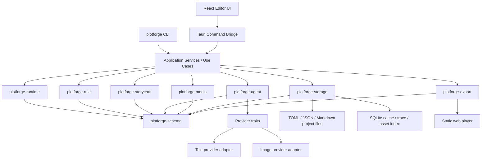

# Project Overview

## Preliminary Direction

Initialize PlotForge as a private GitHub repository, then build the PRD-defined MVP as a Rust-first CLI/Core prototype before adding desktop UI and real providers.

## Current Architecture

This is a PRD-first new repository. The only tracked product source at the start of the workflow is `docs/plotforge_prd_final.md`; there is no source scaffold yet.



Core crates must not depend on Tauri, React, SQLite implementations, concrete providers, or Steam APIs. Apps and adapters depend inward on typed core contracts.

## Technology Stack

| Layer | Current | Target |
|:--|:--|:--|
| Language | Markdown PRD only | Rust core, TypeScript UI |
| Framework | None | Tauri v2, React, Vite, Tailwind |
| Build Tool | None | Cargo workspace, npm/pnpm workspace later |
| Package Mgr | None | Cargo, npm/pnpm |
| Database | None | SQLite as cache/index/trace only |
| Source Data | PRD | Folder project with TOML/JSON/Markdown |
| Deployment | Private GitHub repo | Desktop app, CLI, static web export |

## Entry Points

- `Cargo.toml`: Rust workspace root.
- `crates/plotforge-schema/src/lib.rs`: data contracts and serde types.
- `crates/plotforge-rule/src/lib.rs`: declarative rule evaluation.
- `crates/plotforge-storycraft/src/lib.rs`: story craft state, plot threads, review.
- `crates/plotforge-agent/src/lib.rs`: provider traits and mock generation.
- `crates/plotforge-runtime/src/lib.rs`: scene/beat runtime and trace commit flow.
- `crates/plotforge-storage/src/lib.rs`: folder project loading, writing, trace persistence.
- `crates/plotforge-export/src/lib.rs`: static web export.
- `crates/plotforge-cli/src/main.rs`: MVP command surface.
- `apps/creator-desktop/`: future Tauri + React creator workspace.
- `apps/player-web/`: static export/player template.
- `examples/dynasty-embers/`: built-in demo project.

`plotforge-steam` is intentionally deferred until Workshop/Steam work becomes active.

## Build & Run

The current repository has no runnable code yet. The MVP target commands are:

```bash
cargo check --workspace
cargo test --workspace
cargo fmt --all -- --check
cargo clippy --workspace --all-targets -- -D warnings

cargo run -p plotforge-cli -- new demo
cargo run -p plotforge-cli -- check examples/dynasty-embers
cargo run -p plotforge-cli -- play examples/dynasty-embers
cargo run -p plotforge-cli -- trace inspect examples/dynasty-embers/traces/latest.json
cargo run -p plotforge-cli -- export static examples/dynasty-embers --out dist/dynasty-embers
```

Desktop commands are deferred until the core contracts stabilize.

## External Integrations

- GitHub private repository: `zhu1090093659/plotforge`.
- GitHub Issues and Milestones: available in `GITHUB_STANDARD` mode.
- Tauri v2: future desktop shell and OS permissions.
- Local filesystem: project files, assets, traces, saves, exports.
- SQLite: future cache/index/trace adapter, not source of truth.
- OpenAI-compatible text/image providers: future adapter implementations behind Rust traits.
- Static Web Export: MVP export target with prebaked text/assets and no API key.
