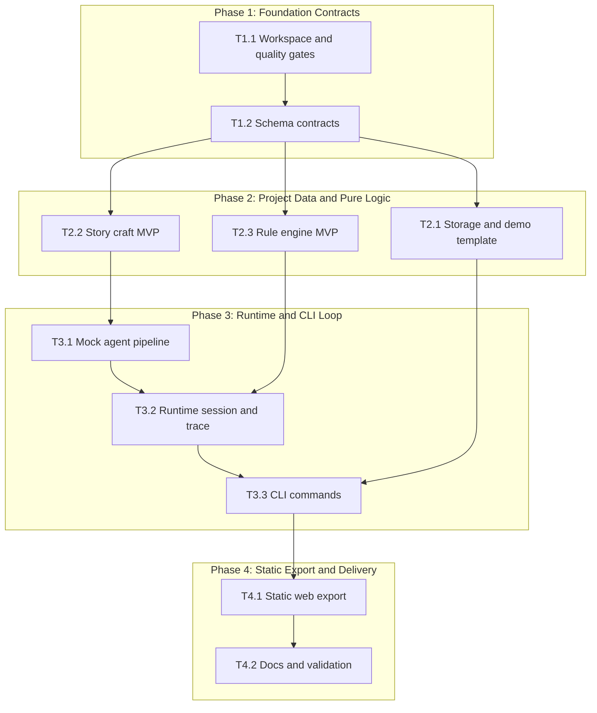

# Task Dependency Graph

```mermaid
graph TD
    subgraph P1["Phase 1: Foundation Contracts"]
        T1_1["T1.1 Workspace and quality gates"]
        T1_2["T1.2 Schema contracts"]
        T1_1 --> T1_2
    end

    subgraph P2["Phase 2: Project Data and Pure Logic"]
        T2_1["T2.1 Storage and demo template"]
        T2_2["T2.2 Story craft MVP"]
        T2_3["T2.3 Rule engine MVP"]
    end

    subgraph P3["Phase 3: Runtime and CLI Loop"]
        T3_1["T3.1 Mock agent pipeline"]
        T3_2["T3.2 Runtime session and trace"]
        T3_3["T3.3 CLI commands"]
        T3_1 --> T3_2
        T3_2 --> T3_3
    end

    subgraph P4["Phase 4: Static Export and Delivery"]
        T4_1["T4.1 Static web export"]
        T4_2["T4.2 Docs and validation"]
    end

    T1_2 --> T2_1
    T1_2 --> T2_2
    T1_2 --> T2_3
    T2_2 --> T3_1
    T2_3 --> T3_2
    T2_1 --> T3_3
    T3_3 --> T4_1
    T4_1 --> T4_2
```
