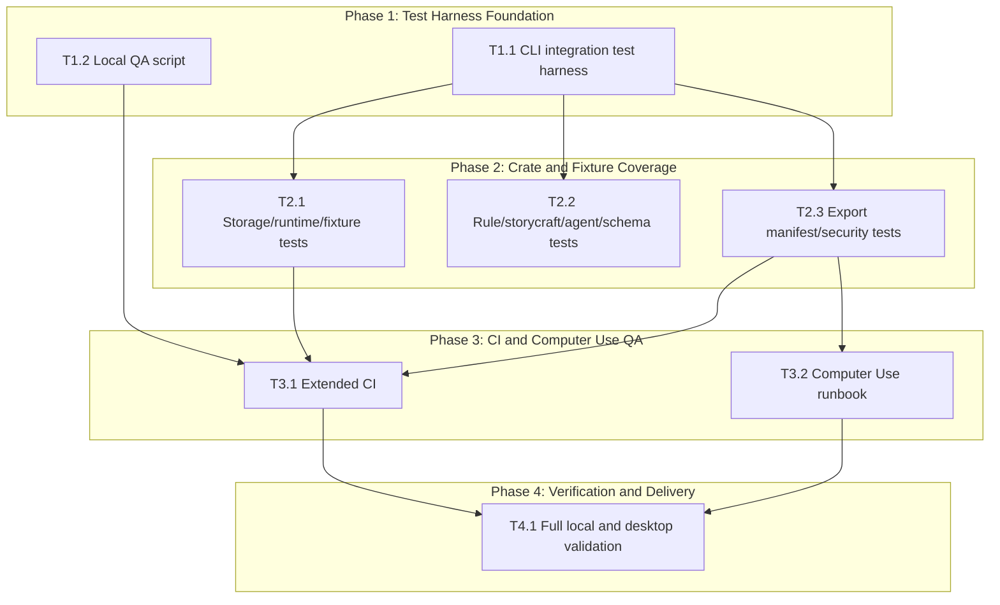

# Task Dependency Graph

```mermaid
graph TD
    subgraph P1["Phase 1: Test Harness Foundation"]
        T1_1["T1.1 CLI integration test harness"]
        T1_2["T1.2 Local QA script"]
    end

    subgraph P2["Phase 2: Crate and Fixture Coverage"]
        T2_1["T2.1 Storage/runtime/fixture tests"]
        T2_2["T2.2 Rule/storycraft/agent/schema tests"]
        T2_3["T2.3 Export manifest/security tests"]
    end

    subgraph P3["Phase 3: CI and Computer Use QA"]
        T3_1["T3.1 Extended CI"]
        T3_2["T3.2 Computer Use runbook"]
    end

    subgraph P4["Phase 4: Verification and Delivery"]
        T4_1["T4.1 Full local and desktop validation"]
    end

    T1_1 --> T2_1
    T1_1 --> T2_2
    T1_1 --> T2_3
    T1_2 --> T3_1
    T2_1 --> T3_1
    T2_3 --> T3_1
    T2_3 --> T3_2
    T3_1 --> T4_1
    T3_2 --> T4_1
```

