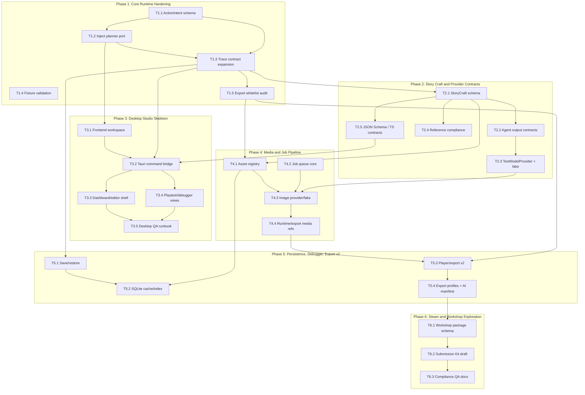

# Task Dependency Graph

## Parallel Execution Notes

- Phase 1 lane B (`T1.4`) can run alongside lane A; lane C waits for trace/export boundaries.
- Phase 2 lane C can start once StoryCraft schema is stable, independent of provider fake work.
- Phase 3 UI lanes can split after the Tauri command bridge exists.
- Phase 4 asset registry and job queue can start in parallel, then converge in image provider integration.
- Phase 5 SQLite cache should not start until save and asset contracts are stable.
- Phase 6 remains deliberately late and mostly offline/schema-driven.
